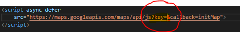

## Get started
1. Clone the project 
2. Add your own Google Maps API key to the map script in the following files:  
    public >> templates >> **map.html**  
    views >> **home.hbs**  
    geocode >> **geocode.js**  

3. From the root folder run:   **npm install**
4. From the root folder run:   **node server.js**
5. Run program on local host 8080.
